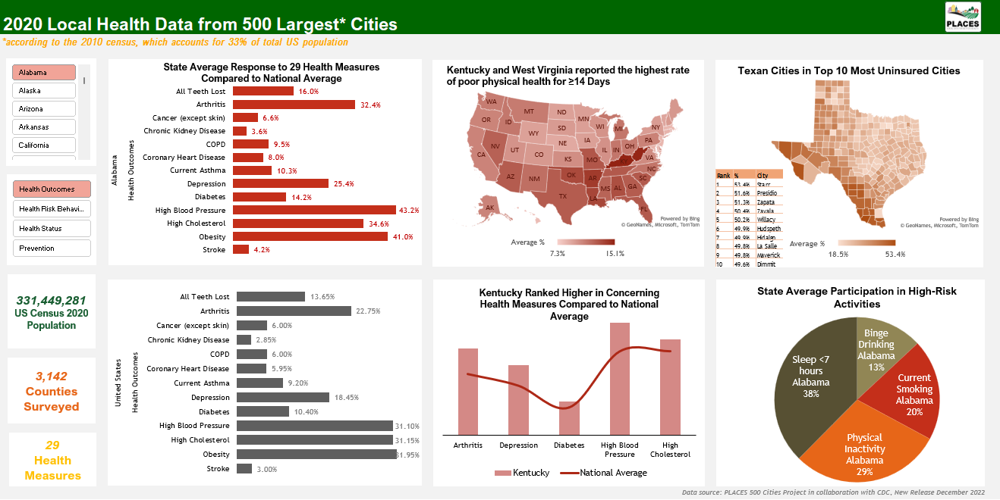

# Project 1: Excel Dynamic Dashboard

This Excel dynamic dashboard visualizes 2020 local health data from PLACES 500 Cities Project.
This project shows state average responses to 29 health measures, categorized into four groups: Health Outcomes, Health Risk Behaviors, Prevention, and Health Status.

## Data Source
PLACES: Local Data for Better Health, [County Data 2022 release](https://chronicdata.cdc.gov/500-Cities-Places/PLACES-Local-Data-for-Better-Health-County-Data-20/swc5-untb)

## Result

